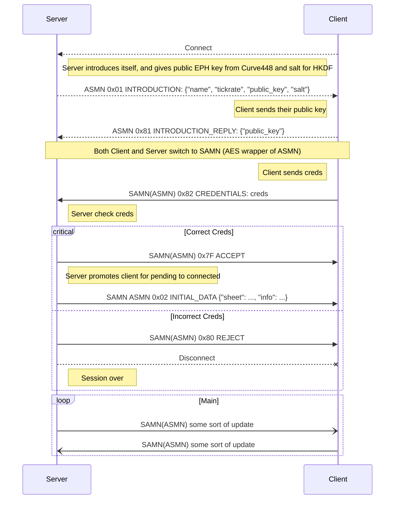
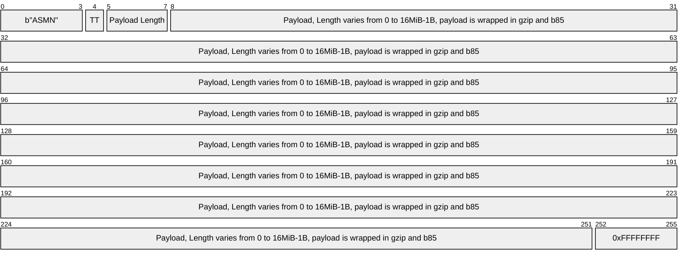
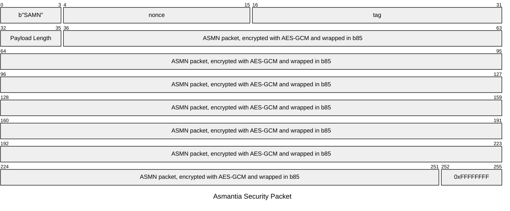

## Example of communication between server and client

```mermaid
sequenceDiagram
    participant S as Server
    participant C as Client
	C-->>S: Connect
    Note right of S: Server introduces itself, and gives public EPH key from Curve448 and salt for HKDF
    S-->>C: ASMN 0x01 INTRODUCTION: {"name", "tickrate", "public_key", "salt"}
    Note left of C: Client sends their public key
    C-->>S: ASMN 0x81 INTRODUCTION_REPLY: {"public_key"}
    Note over S, C: Both Client and Server switch to SAMN (AES wrapper of ASMN)
    Note left of C: Client sends creds
    C->>S: SAMN(ASMN) 0x82 CREDENTIALS: creds
    Note right of S: Server check creds
    Critical Correct Creds
	    S->>C: SAMN(ASMN) 0x7F ACCEPT
	    Note right of S: Server promotes client for pending to connected
    S->>C: SAMN ASMN 0x02 INITIAL_DATA {"sheet": ..., "info": ...}
	Option Incorrect Creds
	    S->>C: SAMN(ASMN) 0x80 REJECT
	    S--xC: Disconnect
	    Note right of S: Session over
	end
    loop Main
	    S-)C: SAMN(ASMN) some sort of update
	    C-)S: SAMN(ASMN) some sort of update
	end
```
### ASMN Packet Structure

```mermaid
packet
+4: "b\"ASMN\"" %% to identify packets
+1: "TT" %% packet type
+3: "Payload Length" %% Length of wrapped payload, varies from 0 to 16MiB-1B
+244: "Payload, Length varies from 0 to 16MiB-1B, payload is wrapped in gzip and b85"
+4: "0xFFFFFFFF"
```
### SAMN Packet Structure

```mermaid
---
title: "Asmantia Security Packet"
---
packet
+4: "b\"SAMN\"" %% to identify packets
+12: "nonce"
+16: "tag"
+4: "Payload Length"
+216: "ASMN packet, encrypted with AES-GCM and wrapped in b85"
+4: "0xFFFFFFFF"
```

